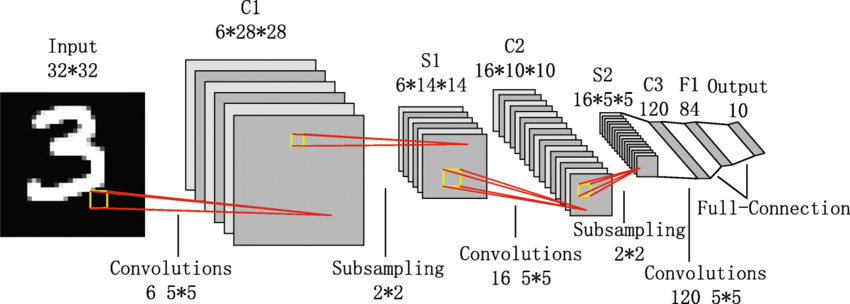
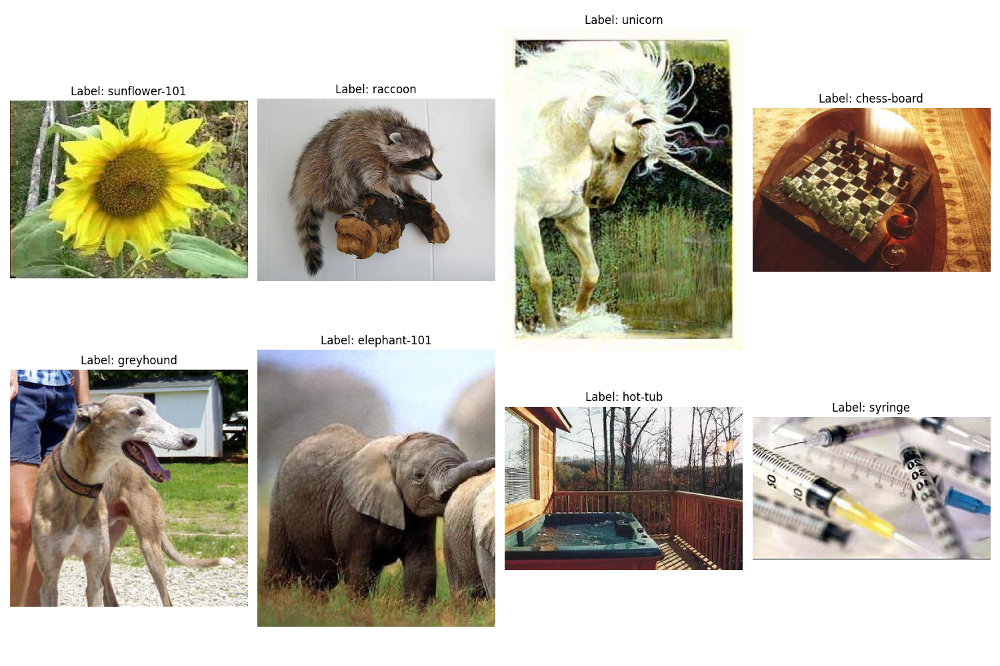
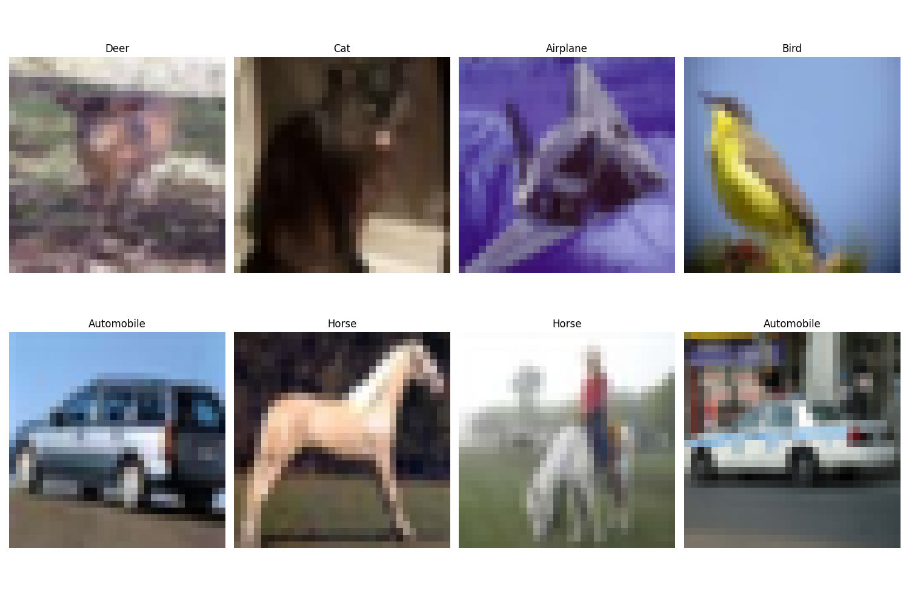
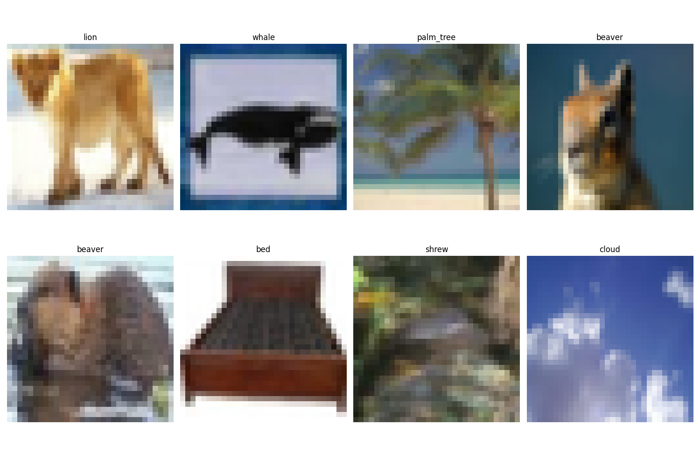
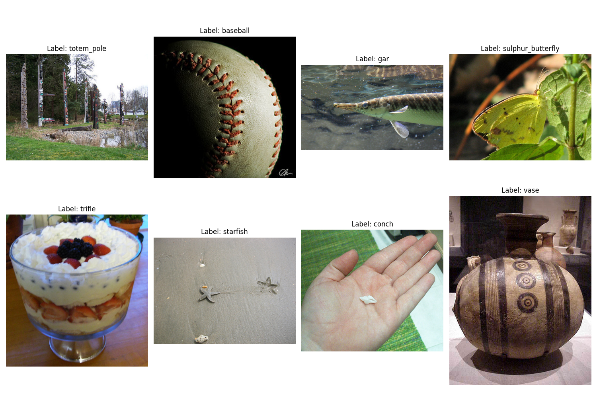
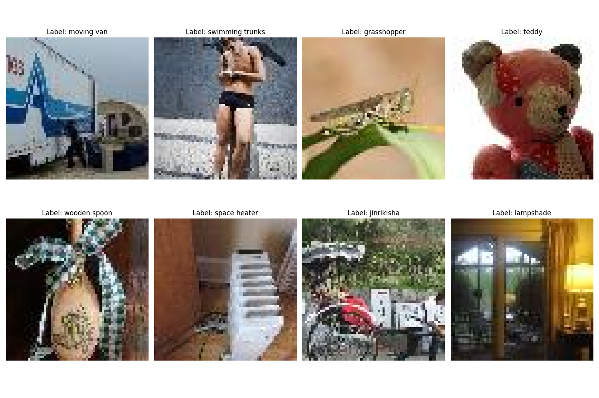
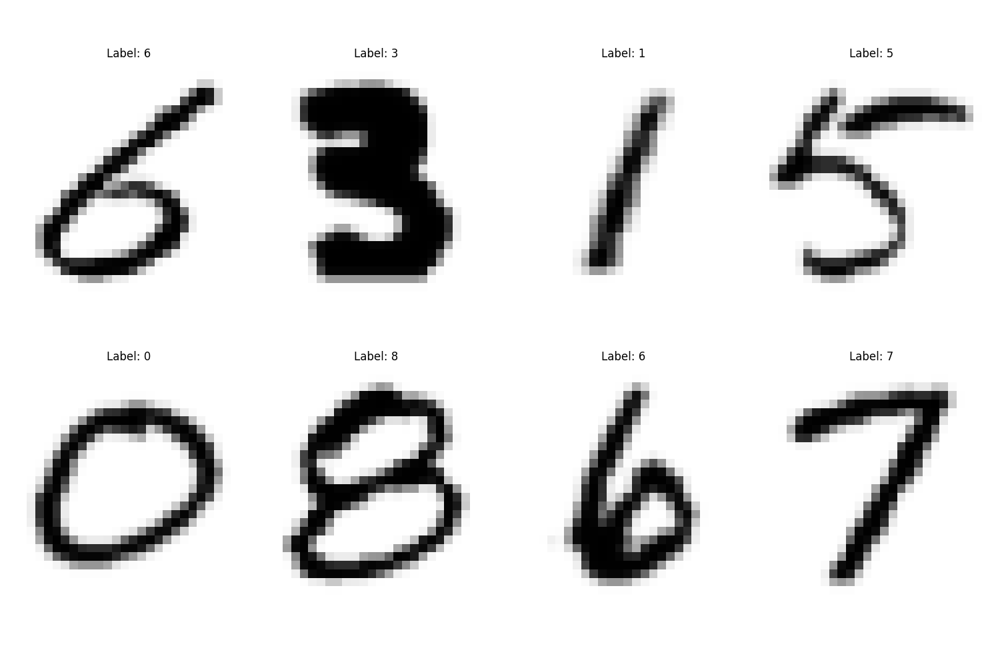

# Image Recognition Library
## Goal of this repository
I made this repository mainly to archive ML models for image recognition, but i also wanted to create a library of some ML models for others to perhaps learn and use to train on other datasets.
## Content of this repository

# Models

## LeNet
Original paper: http://vision.stanford.edu/cs598_spring07/papers/Lecun98.pdf

Convolutional neural network (CNN) developed by Yann LeCun in the 1990s, designed for handwritten digit recognition. It consists of two convolutional layers for feature extraction, each followed by average pooling for downsampling, and two fully connected layers for classification.

Architecture: Input (32x32) → Conv1 (6x5x5) → Pool1 → Conv2 (16x5x5) → Pool2 → FC1 (120) → FC2 (84)

## AlexNet

## VGG16/19

## GoogLeNet

## ResNet (18, 34, 50, 101)

## Xception

## EfficientNet

## EfficientNetV2

# Datasets

## Caltech256

Number of categories: **256**

Number of images: **30,607**, with at least **80 images per category**

Size of images: **3x224x224** after preprocessing but original images sizes vary.  

## CIFAR-10

Number of categories: **10**

Number of images: **60,000 color images**

Number of training images: **50,000** 

Number of testing images: **10,000 testing images**.

Size of images: **3x32x32**

## CIFAR-100

## ImageNet

## TinyImageNet

## EMNIST

# Results

### Accuracy

|                | TinyImageNet | CIFAR-10 | CIFAR-100 | EMNIST | ImageNet | Caltech-256 |
|----------------|--------------|----------|-----------|--------|----------|-------------|
| LeNet          |              |          |           |        |          |
| AlexNet        |              |          |           |        |          |
| VGG16          |              |          |           |        |          |
| VGG19          |              |          |           |        |          |
| ResNet18       |              |          |           |        |          |
| ResNet34       |              |          |           |        |          |
| ResNet50       |              |          |           |        |          |
| ResNet101      |              |          |           |        |          |
| GoogLeNet      |              |          |           |        |          |
| Xception       |              |          |           |        |          |
| EfficientNet   |              |          |           |        |          |
| EfficientNetV2 |              |          |           |        |          |

